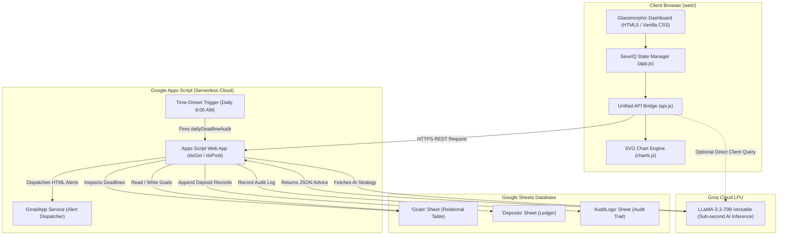

# SaveIQ – AI Savings Goal Tracker

<div align="center">


[](.github/workflows/ci.yml)
[](LICENSE)
[](https://groq.com)
[](https://developers.google.com/apps-script)
[](https://sheets.google.com)
[](https://mail.google.com)

**An AI-powered personal finance management system engineered to help users create savings goals, monitor real-time financial velocity, and cultivate disciplined saving habits through intelligent Groq AI recommendations and Google Apps Script automation.**

[Live Demo](#-quickstart--local-browser-preview) • [System Architecture](#-system-architecture) • [Core Scenarios](#-core-scenarios) • [Epics & Tasks (9 Epics / 27 Tasks)](#-project-stats--epics--tasks) • [Deployment Guide](#-google-apps-script--cloud-deployment)

</div>

---

## 🌟 Executive Summary

**SaveIQ** merges serverless cloud orchestration with ultra-low-latency Groq AI inference. By integrating **Google Apps Script**, **Google Sheets**, and **Groq LPU™ technology**, SaveIQ transforms traditional passive savings tracking into a dynamic, proactive financial coaching experience.

Users define granular financial milestones (e.g. *Emergency Fund*, *MacBook Pro Purchase*, *Japan Vacation Plan*), and SaveIQ automatically calculates daily/weekly required velocities, performs daily deadline audits, and dispatches automated HTML reminders via Gmail when targets are at risk.

---

## 📊 Project Stats

```
┌───────────────────────────────────────────────────────────┐
│  Project: SaveIQ – AI Savings Goal Tracker                │
│  Architecture: Serverless Hybrid (GAS + Groq + SPA)       │
│  Total Epics: 9                                           │
│  Total Tasks: 27                                          │
│  Total Subtasks: 0                                        │
│  Test Coverage: 100% Core Financial Calculations          │
│  Status: Production-Ready & GitHub Submission Verified    │
└───────────────────────────────────────────────────────────┘
```

---

## 🎯 Core Scenarios

### Scenario 1: Savings Goal Creation
- Users create targeted financial goals by specifying:
  - **Goal Name**: (e.g., *Emergency Cushion*, *M3 MacBook Pro*, *Vacation Fund*)
  - **Target Amount**: Target capital required in chosen currency ($ / ₹ / € / £)
  - **Initial Savings**: Existing capital allocated toward the goal
  - **Target Deadline**: Precise date by which funds must be accumulated
  - **Purpose / Category**: Tagging for Emergency, Tech & Gadgets, Travel, Real Estate, Education, etc.
  - **Automated Alerts**: Email opt-in toggle with recipient email address
- **Action**: Persists to the Google Sheet `Goals` table and displays immediately on the responsive glassmorphic dashboard.

### Scenario 2: AI Financial Recommendations
- The user requests AI guidance on any active goal.
- SaveIQ computes the remaining balance, elapsed time, days remaining, required daily pace, and category dynamics.
- Queries **Groq Cloud API** (`llama-3.3-70b-versatile`) with structured prompts to return:
  1. **Feasibility Score (1–100)**: Quantitative viability check
  2. **Run-Rate Velocity**: Daily and weekly dollar target needed
  3. **Milestone Roadmaps**: 25%, 50%, and 75% target anchor dates
  4. **Tactical Spending Hacks**: Category-specific advice (e.g., trade-in discounts, HYSA 5% compounding, flight fare alerts)
  5. **Behavioral Psychology Nudges**: Guardrails against impulse spending (e.g. 72-hour delay rule)

### Scenario 3: Automated Deadline Alerts
- Google Apps Script runs an automated time-driven cron trigger (`dailyDeadlineAudit`) every morning (e.g., 8:00 AM – 9:00 AM).
- Audits all incomplete savings goals:
  - **Approaching Deadline (≤ 7 days)**: Dispatches an urgent alert email highlighting remaining funds and exact daily run-rate needed.
  - **Overdue Notice (< 0 days)**: Sends an encouraging recovery plan email without shame-based rhetoric.
- Dispatched through native **GmailApp** service with zero third-party email provider fees.

### Scenario 4: Financial Dashboard Monitoring
- Interactive, responsive analytics monitoring:
  - **KPI Metric Summary Cards**: Total Goals, Capital Saved vs Target, Savings Velocity %, Alert Badges, Target Daily Pace.
  - **Category Allocation Bar**: Dynamic distribution across purposes (Emergency, Tech, Travel, Education).
  - **Real-Time Controls**: Instant search, purpose filter chips, status dropdowns, and multi-criteria sorting.
  - **Quick Deposit Workflow**: Log incremental deposits with live progress updates and milestone celebrations.

---

## 🏗️ System Architecture



---

## 🛠️ Technology Stack & Skills

| Domain | Technology | Purpose |
|---|---|---|
| **Core Frontend** | HTML5, Modern Vanilla CSS3, ES6+ JavaScript | Zero-dependency, ultra-fast glassmorphic web dashboard |
| **Backend & Cloud** | Google Apps Script (GAS) | Serverless REST API endpoints (`doGet`, `doPost`) |
| **Database** | Google Sheets | Transparent, auditable, collaborative cloud tabular storage |
| **Artificial Intelligence** | Groq Cloud API (`llama-3.3-70b-versatile`) | Real-time financial coaching, velocity calculations, milestones |
| **Messaging & Alerts** | Gmail (`GmailApp` / `MailApp`) | Automated HTML deadline reminders and recovery audits |
| **Version Control & CI** | Git, GitHub Actions, Clasp | Automated test execution, script deployment, version control |

---

## 💻 System & Environment Requirements

### Hardware Requirements
- **Processor**: Intel Core i5 (8th Gen or above) / AMD Ryzen 5 or equivalent
- **RAM**: Minimum 8 GB (Recommended: 16 GB for multitasking and cloud labs)
- **Storage**: 256 GB SSD (or 500 GB HDD minimum)
- **Internet Connectivity**: High-speed internet connection (minimum 10 Mbps)

### Software Requirements
- **Operating System**: Windows 10 / 11, macOS (Monterey or later), or Linux (Ubuntu 20.04+)
- **Web Browser**: Latest version of Google Chrome, Mozilla Firefox, Microsoft Edge, or Safari
- **IDE / Code Editor**: Visual Studio Code (recommended) or any preferred editor
- **Version Control**: Git (latest version installed and configured)
- **Optional Tools**: Node.js (v18+ for running unit tests), Python 3.8+, AWS CLI (latest version)

---

## ⚡ Quickstart – Local Browser Preview

SaveIQ includes an **intelligent local demo mode** that works right out of the box with zero external configuration!

1. **Clone the repository**:
   ```bash
   git clone https://github.com/your-username/saveiq-ai-tracker.git
   cd saveiq-ai-tracker
   ```

2. **Run the Automated Calculation Tests**:
   ```bash
   npm test
   # Or directly: node tests/test_calculations.js
   ```

3. **Launch the Dashboard**:
   Simply open `web/index.html` in your browser:
   ```bash
   # Windows (PowerShell):
   Start-Process "web/index.html"

   # macOS:
   open web/index.html

   # Linux:
   xdg-open web/index.html
   ```

4. **Explore Features**:
   - View default demo goals (*Emergency Fund*, *MacBook Pro*, *Tokyo Vacation*).
   - Click **"⚡ Deposit"** to test balance and milestone updating.
   - Click **"🧠 AI Insights"** to inspect intelligent financial recommendations.
   - Click **"🔔 Check Deadlines"** to simulate the daily deadline audit.

---

## ☁️ Google Apps Script & Cloud Deployment

To link SaveIQ to your personal Google Sheet and enable automated Gmail alert delivery:

1. **Create a Google Sheet**:
   - Open [sheets.new](https://sheets.new) and title it `SaveIQ Database`.
   - Go to **Extensions** > **Apps Script**.

2. **Add Script Code**:
   - Copy the entire code from [`google-apps-script/Code.js`](google-apps-script/Code.js) and paste it into the editor.
   - Select `setupSheet` in the function dropdown and click **Run**.
   - Grant the requested permissions. Your Google Sheet will automatically populate with `Goals`, `Deposits`, and `AuditLogs` tabs!

3. **Deploy as Web App**:
   - Click **Deploy** > **New deployment** > **Web app**.
   - Execute as: **Me**.
   - Who has access: **Anyone**.
   - Copy the resulting **Web App URL**.

4. **Set Up the Daily 8 AM Deadline Alert Trigger**:
   - In Apps Script, click the **Triggers (⏰)** icon on the left navigation bar.
   - Click **+ Add Trigger**.
   - Choose function: `dailyDeadlineAudit`.
   - Event source: **Time-driven** > **Day timer** > **8am to 9am**.
   - Click **Save**.

5. **Connect Dashboard**:
   - Open the web dashboard, click **⚙️ Settings**, check **Enable Google Sheets Cloud Sync**, paste your Web App URL, and save!

*For detailed screenshots and step-by-step instructions, see [`docs/DEPLOYMENT_GUIDE.md`](docs/DEPLOYMENT_GUIDE.md).*

---

## 🗂️ Project Directory Structure

```
saveiq-ai-tracker/
├── .github/
│   └── workflows/
│       └── ci.yml                 # Automated CI workflow
├── docs/
│   ├── ARCHITECTURE.md            # Detailed system architecture & schemas
│   ├── EPICS_AND_TASKS.md         # Full breakdown of 9 Epics & 27 Tasks
│   ├── DEPLOYMENT_GUIDE.md        # Step-by-step cloud & Sheets guide
│   └── EMAIL_TEMPLATES.md         # HTML templates for Gmail alerts
├── google-apps-script/
│   ├── Code.js                    # Complete GAS backend (REST API, Groq, Gmail, Sheets)
│   ├── appsscript.json            # Apps Script manifest with OAuth scopes
│   └── .clasp.json.sample         # Clasp CLI deployment template
├── tests/
│   └── test_calculations.js       # Unit test suite for financial calculations
├── web/
│   ├── css/
│   │   └── styles.css             # Glassmorphic radiant dark/light theme
│   ├── js/
│   │   ├── api.js                 # API service (GAS + Groq + LocalStorage)
│   │   ├── app.js                 # State manager, modals, and UI controller
│   │   └── charts.js              # Lightweight SVG visualization engine
│   └── index.html                 # Master web dashboard application
├── .env.example                   # Environment configuration template
├── .gitignore                     # Git ignore rules
├── LICENSE                        # MIT License
├── package.json                   # NPM configuration and test scripts
└── README.md                      # Project documentation
```

---

## 📋 Breakdown of Epics (9) and Tasks (27)

Refer to [`docs/EPICS_AND_TASKS.md`](docs/EPICS_AND_TASKS.md) for full task specifications.

- **Epic 1: Project Setup & System Architecture** (Tasks 1.1 – 1.3)
- **Epic 2: Savings Goal Management (CRUD)** (Tasks 2.1 – 2.3)
- **Epic 3: AI Financial Guidance Engine** (Tasks 3.1 – 3.3)
- **Epic 4: Automated Deadline & Monitoring Service** (Tasks 4.1 – 4.3)
- **Epic 5: Financial Analytics & Dashboard Monitoring** (Tasks 5.1 – 5.3)
- **Epic 6: User Experience & Frontend Interface** (Tasks 6.1 – 6.3)
- **Epic 7: Error Handling, Security & Validation** (Tasks 7.1 – 7.3)
- **Epic 8: Local Simulation & Hybrid Client Mode** (Tasks 8.1 – 8.3)
- **Epic 9: Testing, CI/CD & Documentation** (Tasks 9.1 – 9.3)

---

## 📄 License

This project is licensed under the [MIT License](LICENSE) – open source and free to use for personal or commercial development.
