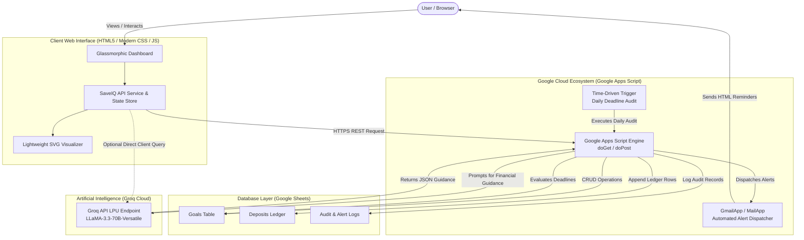
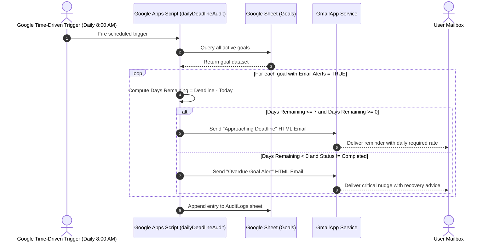

# SaveIQ – System Architecture & Technical Specifications

SaveIQ is an AI-powered personal finance management system developed to help users create savings goals, track financial progress, and improve saving discipline through intelligent recommendations and automation.

---

## 1. High-Level Architecture Diagram

---

## 2. Core Components

### 2.1 Frontend Web Dashboard (`web/`)
- **Technology**: HTML5, Vanilla CSS3 (Custom Glassmorphism Design System), Modern Vanilla ES6+ JavaScript.
- **Key Modules**:
  - `index.html`: Responsive single-page application structure with accessible ARIA semantics.
  - `css/styles.css`: Radiant dark theme design system, CSS custom properties, responsive breakpoints, smooth animations.
  - `js/app.js`: Master application controller, real-time UI state management, modal handlers, and toast notifications.
  - `js/api.js`: Unified API service bridging Google Apps Script Web App, direct Groq API client, and zero-dependency local storage fallback.
  - `js/charts.js`: Lightweight SVG data visualizer for category distribution, velocity meters, and progress arcs.

### 2.2 Google Apps Script Backend (`google-apps-script/Code.js`)
- **Serverless API**: Exposes `doGet` and `doPost` endpoints supporting CORS for external web dashboards or native GAS HTML serving.
- **Database Handler**: Handles row creation, updates, and balance recalculations in Google Sheets with sub-second execution times.
- **AI Recommendation Engine**: Integrates with Groq's high-speed LPU inference engine to analyze financial trajectories and generate milestone roadmaps.
- **Deadline Sentinel**: Time-driven cron trigger auditing goals daily, calculating urgency, and generating responsive HTML emails sent via `GmailApp`.

### 2.3 Database Schema (Google Sheets)
SaveIQ utilizes Google Sheets as a transparent, auditable relational store consisting of three primary sheets:

#### 1. `Goals` Sheet
| Column Index | Field Name | Type | Description |
|---|---|---|---|
| A | `Goal ID` | String | Unique goal identifier (e.g. `GOAL-1001`) |
| B | `Goal Name` | String | User-defined title (e.g. "Emergency Fund") |
| C | `Target Amount` | Number | Monetary target in base currency |
| D | `Current Savings` | Number | Accumulated saved capital |
| E | `Deadline` | String (YYYY-MM-DD) | Target completion date |
| F | `Email Alerts` | Boolean | Notification opt-in flag (`TRUE` / `FALSE`) |
| G | `Alert Email` | String | Recipient email address |
| H | `Purpose` | String | Category tag (Emergency, Tech, Vacation, etc.) |
| I | `Status` | String | `Active` \| `Approaching` \| `Completed` \| `Overdue` |
| J | `Created At` | ISO Timestamp | Creation timestamp |
| K | `Last Updated` | ISO Timestamp | Last modified timestamp |

#### 2. `Deposits` Sheet
| Column Index | Field Name | Type | Description |
|---|---|---|---|
| A | `Deposit ID` | String | Transaction identifier (e.g. `DEP-501`) |
| B | `Goal ID` | String | Foreign key reference to `Goals` table |
| C | `Goal Name` | String | Human-readable goal name |
| D | `Amount` | Number | Deposited capital increment |
| E | `Date` | Timestamp | Transaction timestamp |
| F | `Note` | String | Optional allocation memo |

#### 3. `AuditLogs` Sheet
| Column Index | Field Name | Type | Description |
|---|---|---|---|
| A | `Timestamp` | ISO Timestamp | Execution time of the daily audit |
| B | `Total Goals Checked` | Number | Count of active records evaluated |
| C | `Alerts Sent` | Number | Quantity of emails dispatched |
| D | `Details` | String | Audit summary and error traces |

---

## 3. Groq AI Integration Specifications

- **Endpoint**: `https://api.groq.com/openai/v1/chat/completions`
- **Primary Model**: `llama-3.3-70b-versatile`
- **Fallback Model**: `llama-3.1-8b-instant`
- **Inference Latency**: Sub-second (~300ms–800ms) on Groq Language Processing Units (LPUs).
- **Prompt Engineering**: Structured JSON output format enforcing:
  1. Feasibility score ($1-100$)
  2. Velocity breakdown (required daily and weekly savings)
  3. Actionable milestone roadmap
  4. Behavioral psychology nudges (e.g., 48-Hour impulse purchase delay, subscription audits)

---

## 4. Automated Deadline Alert Lifecycle

